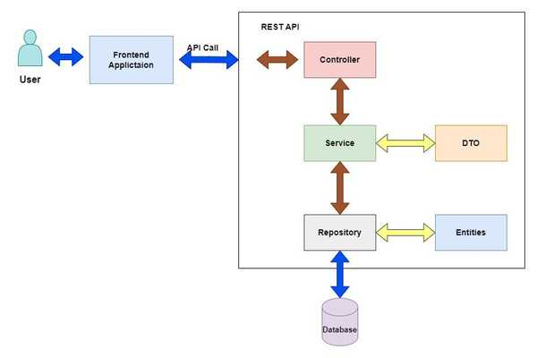

# Employee Control App - Backend

Este es el backend del proyecto **Employee Control**, desarrollado con **Spring Boot**.  
Expone una **API REST** para gestionar empleados con operaciones **CRUD** y está integrado con un frontend en React.

### Tecnologías Usadas

* Java 21
* Spring Boot
   * Spring Web
   * Spring Data JPA
   * Spring Validation
* ModelMapper: para conversión entre entidades y DTOs.
* Swagger / OpenAPI:  documentación interactiva de la API
  * Para usarlo localmente (clonando el repositorio): [Swagger Local](http://localhost:8080/swagger-ui/index.html)
  * Para usarlo online: [Swagger Online](https://employee-control-app-backend.onrender.com/swagger-ui/index.html)
* H2 Database: para el desarrollo local.
  * Para usarlo localmente (clonando el repositorio): [H2 Console Local](http://localhost:8080/h2-console)
  1. JDBC URL: jdbc:h2:mem:employee_db
  2. user: sa
  3. password: password
* MySQL: para producción en Render.
* Lombok: para reducir código repetitivo con anotaciones

### Estructura del proyecto

>src/main/java/com.gaston.project.employee/
>> controller/ : Controlador REST
> 
>> dto/ : Clase DTO con validaciones 
> 
>> services/ : Logica de negocio
> 
>> entities/ : Entidad JPA
> 
>> repository/ : Interfaz de acceso a datos
> 
>> configuration/ : Configuracion del Swagger, Cors y ModelMapper

>src/main/resources/
>>  application.properties/ : Asigno el entorno de trabajo
>
>>  application-dev.properties/ : Configuración para desarrollo
>
>>  application-prod.properties/ : Configuración para producción


### Endpoints

| Metodo |                  Endpoint                  |         Descripcion         |
|--------|:------------------------------------------:|:---------------------------:|
| GET    |          /api/employee/find/{id}           | 	Obtiene un empleado por ID |
| GET    |           /api/employee/findall            | Obtiene todos los empleados |
| POST   |            /api/employee/create            |   Crea un nuevo empleado    | 
| UPDATE |         /api/employee/update/{id}          |    Actualiza un empleado    | 
| DELETE |      /api/employee/delete/{id}             |     Elimina un empleado     | 

### Cambio de entorno

En caso de que se quiera clonar el repositorio y ejecutar el codigo **localmente** es necesario hacer el siguiente cambio para que funcione:
1. En *src/main/resources/application.properties/* es necesario comentar *spring.profiles.active=prod* y descomentar *spring.profiles.active=dev*, que quede de la siguiente manera:
```
#Entorno de desarollo activado => Uso H2 database
spring.profiles.active=dev

#Entorno de produccion activado => Uso MySQL
#spring.profiles.active=prod
```
**Aclaracion**: Al hacer estos cambios, en *src/main/java/com.gaston.project.employee/configuration/CorsConfig* ya se ajuta la ruta dependiendo el entorno:

```
@Value("${frontend.url}")
private String frontendUrl;
```
```
registry.addMapping("/api/**")          //ruta donde habilita CORS
                        .allowedOrigins(frontendUrl)  //ruta del frontend -> produccion: https://gastonguz3.github.io
                                                      //                  -> desarrollo: http://localhost:5173
                        .allowedMethods("GET", "POST", "PUT", "DELETE")
                        .allowedHeaders("*")
                        .allowCredentials(false);
```

### Diagrama 



#### Autor: Gaston Guzman [linKedIn](https://www.linkedin.com/in/gaston-guzman-192730352/).